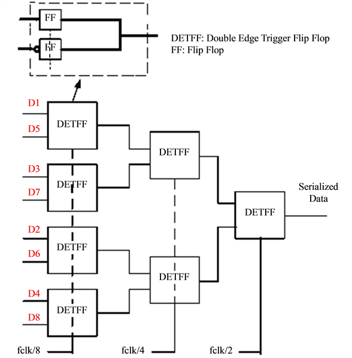
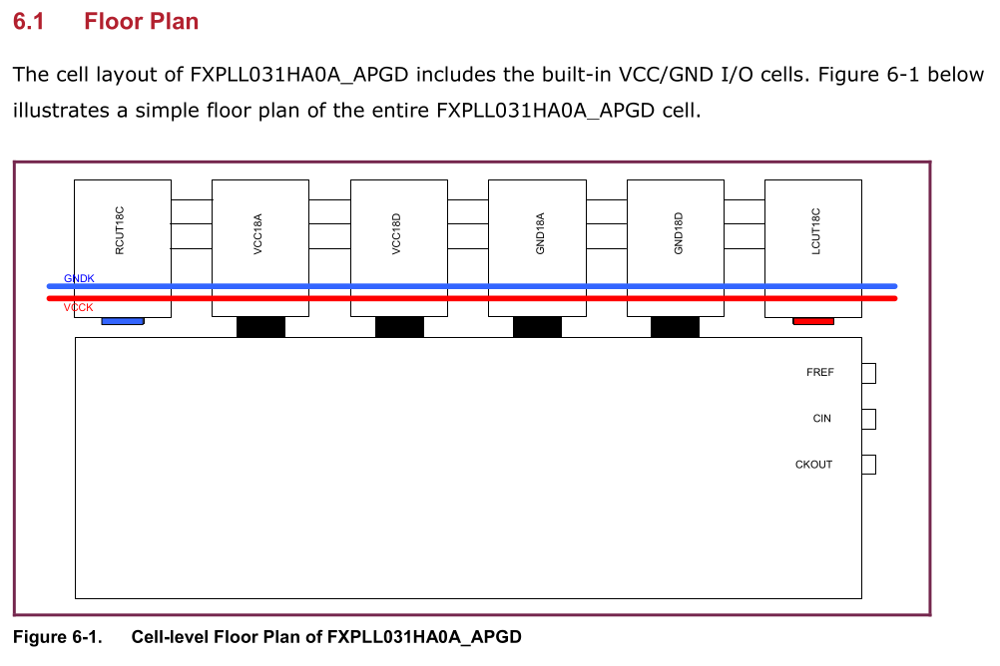
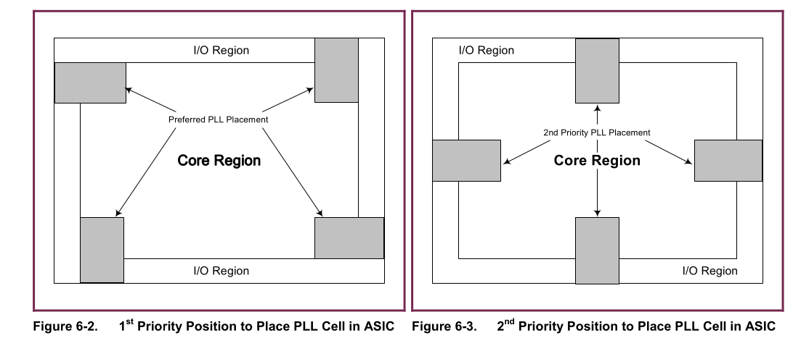
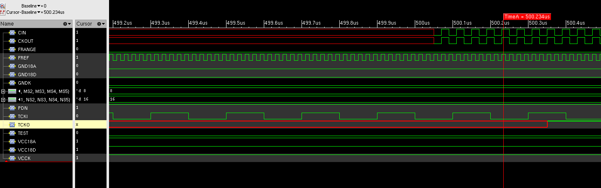
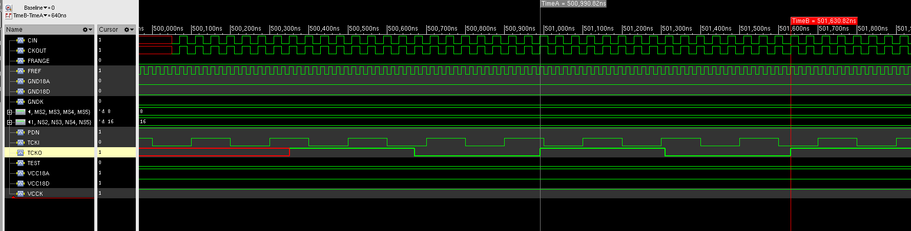
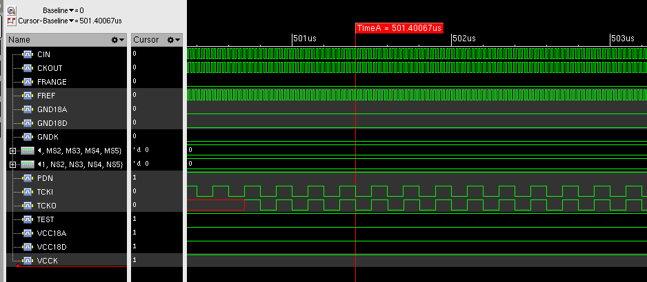
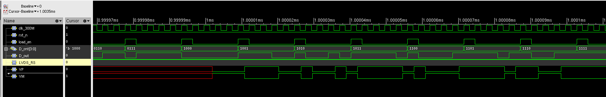
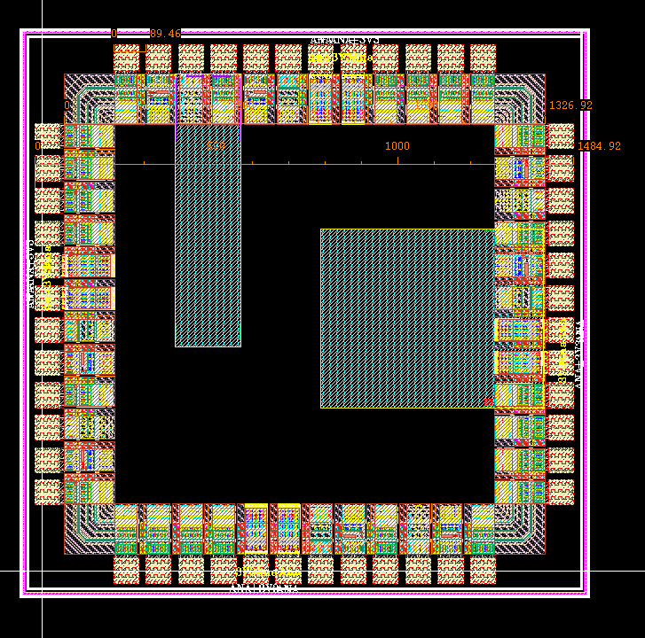
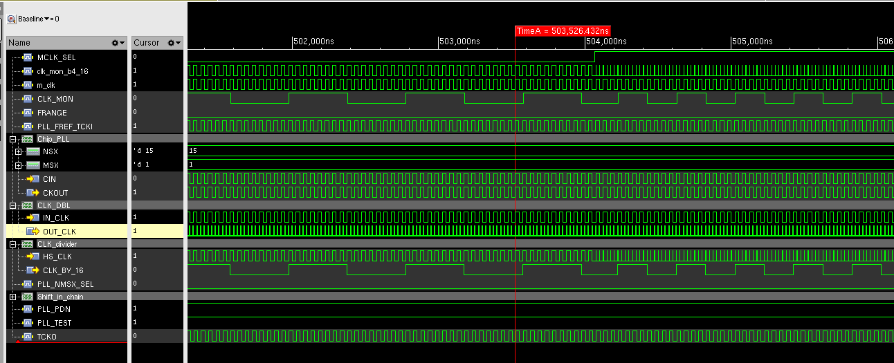
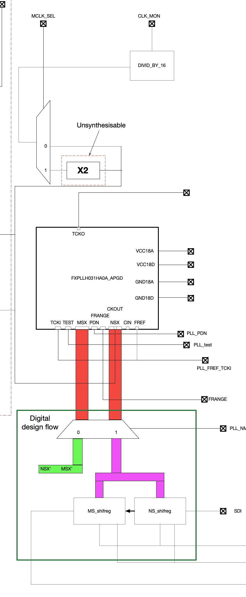

# Chip 3 Mini@sic

This is the project that was a little rushed, main purpose for this project is to verify the tool chain for UMC PDK.

## 26 Aug

I wanted to include the row based encoder for this design (**Row_encoder_5P**), other than that, I would like to include the LVDS transmitter (**FXLVTX020HA0A**) and probably the memory FIFO module (memory module not generated yet, but requested)

First of all, I will try to generate this module's layout and optimise the port (tiktok port has been designed with 45 pins, which is not necessary).

### Stuff I need to write down:

LVDS module can be simulated with the provided! Just make sure the input are correctly set!

+ **VBG** should be set at 1.2 V for the band gap reference.
+ **EN** should be set at 1, and the module will only start waking up after this has been set at 1, the wake up time is about **1 ms**, when **EN** was set to 0, it will be power-down mode. 
+ **RS** is the output swing control pin, not sure what it does to be exact...


**Edit: RS pin decides how much swing we will have for the output voltage, it will be 0.35V when RS=1 or 0.25V when RS=0**


In the meantime, the LVDS module is an IO cell itself, so it does not require more IO cells. 

But to power the cell, it is required to have 2 pairs of independent power cells, for both Analogue 3.3 V and Digital 3.3 V and respective GND.


## 27 Aug

Finished the synthesis for the row based encoder using GII faraday standard cells, which should be compatible. But the flip-flop cells used in the implementation are the scan registers, which causes problems in innovus. Innovus tool will think the design has a scan chain, which does not exist.

Will now redo synthesis and add a scan chain in it.

I have added the scan chain inside the design, but it seems I have designed it in the wrong clock frequency....

I forgot the compression unit works at 40 MHz instead of 20 MHz...

Will have to fix this....

In the mean time, I do not know if this is the correct behaviour for the unit...

## 28 Aug

I realised that my IO cells view were not the correct view and cannot be used for tape out...

And also, I just found this [paper](https://www.scirp.org/journal/paperinformation?paperid=55133) that talks about designing a SerDes using UMC 180 nm, which could be really handy.

They basically used the following block diagram to build a 3 stage encoder serialiser, where DETFF means double edge triggered flip flop




## 1 Sep

I think my plan so far involves the very simple re-implementation of the encoder. This will be the baseline task.

DFT scan chain will be inserted.

To avoid the assign problems with encoder, it is possible to insert buffer during synthesis.

This can be achieved by giving the command in tcl:

```tcl
set_remove_assign_options -verbose
set_db remove_assigns true
```

 
In this design I defined the scan test clock as 1 MHz with the command below:

```tcl
## unit is ps in this case
define_test_clock -name test_clk -period 1000000 clk

## when test is on, rst_n should be 1
define_test_mode -name rst_n -active high rst_n

## when se is high, it is shifting
define_shift_enable -name se -active high se

## define the scan chain to be working in the domain of test_clock
define_scan_chain -sdi scan_in -sdo scan_out -domain test_clk -name encoder_chain
```

Made the implementation of the layout for this Encoder


## 2 Sep

Now I will need to import the GDS back to Virtuoso and verify the gate-level behaviour in Xcelium.

Behaviour level for synthesised gate-level simulation proves to be correct. 

Just need to remember at the final integration to add reset synchronisation.

Will now simulate pnr level gate-level simulation to see how it behaves.

The behaviour has been verified to be correct for pnr gate-level simulation.

I tried to arrange the LVDS module and IO module on the same line and see the size difference on this case.

Still Do not know how to connect the LVDS for the power supply yet...


## 3 Sep

I will have a close look at PLL today and see how to simulate the module and what its behaviour is like and see how to integrate the module.


So if we have the size of chip including bond pad at the size of 1525 x 1525, and we are using bond pad of 65 x 65, which essentially takes 69 x 79 um.

which leaves the total chip size to 1367 x 1367 um


So it appears that the PLL macro will have the IO cells built in and comes with its own powercut cell:




As for the placement of the IP block, it will have to be placed in the preferred corner or centre of the side according to the manual:




## 4 Sep

Also just got confirmed by Steve that our chip will be at the size of 1484.92 x 1484.92 um

And I have also managed to get the simulation of the PLL working.


### Normal mode


If the module works in normal mode, the following configurations are needed:

```text
FRANGE: 0 (CKOUT = 20 - 100 MHz) OR 1 (CKOUT = 100 - 300 MHz)
TEST: 0
NS/MS: divider parameter


PDN: active low, if set, it should be longer than 4 ns. 

CIN = CKOUT
```


The following images show the simulation of the waveform of the PLL generating clock with the set up of N = 16 and M = 8, which results in the output frequency half of the input ref frequency.




In the meantime, the TCKO should be running at 1/16 clock frequency of the output clock CKO, which should be 640 ns.




### Self-test mode

Following set up is needed to configure the PLL

```text
TEST: 1

PDN: Pulse set up
```


This is the self-test mode, where N = 16, and M = 1, which should produce 16 times the original clock frequency, but the test clock has been divided by 16 from the generate clock. Therefore, the test output clock TSCKO should have the same clock frequency as input test clock TCKI.

In the meantime, the CKOUT port has been shorted by FREF, so the output clock CKOUT should be the same as FREF.




### Constructing the test chips

I will now try to do some planning about what we want from chip 3.


## 8 Sep

I have been looking into the construction of serialiser to see how I can make it work without the complexity of introducing multiple clocks within a module.

Now I just made a very simple serialiser, which has an internal index that increments on the main clock.

And then output the data depending on the index.

I have tried other ways to implement it, but did not manage to make it work.


I have just integrated the counter, the serialiser and LVDSTX module together to run the simulation, and this is what it looks like:




As for proper encoding to embed the clock into the data stream, this will be checked and explored later in the design.

The following encoding has been recommended:

```csharp
[preamble] = 64 bits of alternating 1/0  (1010...)
[sync_word] = 16-bit unique pattern (e.g. 0xB5E3)
[rate_id] = 8-bit code (enumerated rates: 0x01=300MHz, 0x02=320MHz, 0x03=600MHz, etc.)
[flags/ctrl] = 8-bit (optional)
[payload_len] = 16-bit
[payload] = N bytes...
[crc32] = 32-bit
```


## 9 Sep

I have just been trying to figure out the layout relationship or floorplan for the whole chip, and realised we cannot put both IP block in the limited size chip 3 has to offer.

Try out of the IP block placement:



The best we could do right now is to forget about putting both cells in I guess, and purely test our PLL...

Or put my old design of encoder in it???

Now I am determined to get one design of PLL only done if possible!

This will be my baseline submission.


let's make it clear what tests we are looking for form the PLL:

1. Built-in test logic, where **TEST = 1**
2. Test on the normal mode where **TEST = 0**
3. Clock doubler and how that works, where **TEST = 0**

Configuration for test 1 is listed here:

```
INPUT:

TEST = 1
TCKI = 5 - 20 MHz
PLL_NMSX_sel = 'X'
FREF = 'X'
FRANGE = 'X'
PLL_PDN = 'X'


OUTPUT:

CKOUT = FREF
TCKO = (16/16)*TCKI
```

Configuration for test 2 is listed here:

```
INPUT:

TEST = 0
TCKI = 'X'
PLL_NMSX_sel = '1'
FREF = 5- 20 MHZ
FRANGE = '1'
NS/MS = 16
PLL_PDN = '1'

OUTPUT:

CKOUT = (N/M)*FREF
TCKO = CKOUT/16
```


## 10 Sep

I am now trying to have a baseline design done with just PLL and maybe clock doubler and divider....


## 11 Sep

Piotr suggested the mutiplexing for the system clock like the following:

```verilog
wire sys_clk;
input EXT_clk;
mux3 i_mux3 (.O(sys_clk), .S0(mclk_sel[0]), .S1(mclk_sel[1]), .A(pll_out), .B(clk_600m), .C(EXT_clk));
```

But to think about it, there is no other component in the design that will require a slow external clock.

Both my serialiser and counter will run at the clock of 300 MHz.

So I do not really see the point of having both high spped clock and normal clock muxed together.

But to observe our high spped possibly 600MHz clock, we can seperate the from the main design.

so, we can just remove the extra external clock input 

```verilg
wire sys_clk;
wire pll_out_buf;


pll inst_pll(
	.CKOUT(pll_out),
	.CKIN(pll_out_buf),
	.FREF(FREF)
	);

BUF4CK I_BUF4X(.O(pll_out_buf), .I(pll_out));

DFF I_DFF(.Q(xx), .CK(pll_out_buf), .D(xx));

mux2 i_mux2 (.O(clk_mon), .S(mclk_sel), .A(pll_out), .B(clk_600m));
```

I have now finally composed the overall architecture of the module with the components I have.

And the behaviour so far has been correct for the normal mode.


I think I have managed to get the simulation working with just purely the PLL and relevant clock circuitry.

But I still do not have the clock doubler.


<<<<<<< HEAD
## 12 Sep

I have verified the normal function behaviour for the structured design, now I will draft the testbench for the module to do Built-in self test and also test on functional mode (where users will identify the parameter N, M themselves)


**Disclaimer: clock doubler may have a very strong application condition**

I also just realised that the clock doubler may be simple design, but it should only be designed to accustomed to a certain clock frequency.

This would only mean that is the output system clock from PLL is not 300 MHz, the clock doubler may not work.

So the whole implementation will not make much sense.



But because the clock doubler only works for 300 MHz, the doubled clock may not have the correct duty cycle or even correct behaviour.

Now the testbench has also tested other two test cases.

One is the functional mode with fixed M/M = 15/1 (15), the other is the functional mode with shifted in N/M, which has been set as 24/4 (6). 

These two have also been verified to be correct.
=======

## 15 Sep

Today I will at least make the synthesis work for the current design.

But the unsynthesisable design in the verilog netlist are the clock doubler.

Given that a lot of the circuitry in the proposed design cannot be done in the general digital flow, I will have to split them into blocks and apply different methodology.


The first bit I am gonna do is the clock configuration circuitry, which is the block that is encapsulated in green box:




I will start drafting the verilog for it now.

OK, I have finished the synthesis for this block, and this has also been verified by the gate-level simulation.

Will start the layout implementation soon.
>>>>>>> 87030fa597bc09127c461363e3c81dbbaaddcc1d

Okay, due to the logic simplicity, Genus has generated a netlist that contains scan flip flop when I actually dont need one.

I will need to redo synthesis now....

Finished another synthesis, and now the module no longer includes any scan cells.

I used the following command to achive this:

```tcl 
set_dont_use [get_lib_cells */DBZ*]
set_dont_use [get_lib_cells */DFZ*]
set_dont_use [get_lib_cells */QDFZ*]
```

The mentioned commands will avoid using these cells to syntehsis the design.


Also the new deisgn wihtout scan cells are now imported into innovus, and floorplan, powerplan, and basic placement have been done.

CTS and detailed routing will be left tomorrow.

